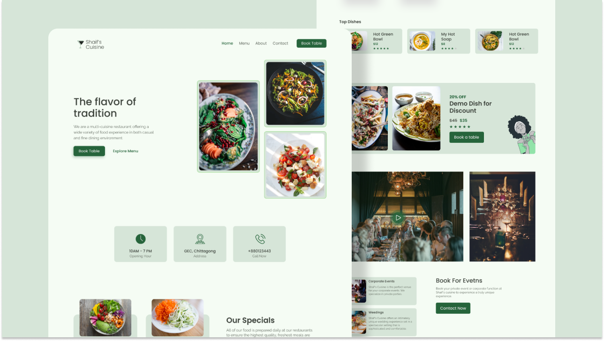

# Sherif's KItchen 👨‍🍳

---

### Made with ❤️ by soliu sherifdeen

---

A `HTML, CSS` Project. Made with ♥ by `DEAN`. There will be 5 pages in the website (HomePage, MenuPage, AboutPage, ContactPage, BookingPage). In this project we gonna learn how we can create a website using simple `HTML, CSS`. The main purpose of the project is to get more used to with HTML, CSS. Although we used a few lines of JavaScript in the project for necessary cases. Later on, in this project, we gonna learn how we can deploy this site using `Netlify`. Also, we gonna learn the process from the zero to end and make the website ready for live production.

## What i implimented

- HTML, CSS
- Js slidders
- CSS Grid
- Scroll Animation
- Netlify Deployment
- Netlify Form functionality
- More . . .

